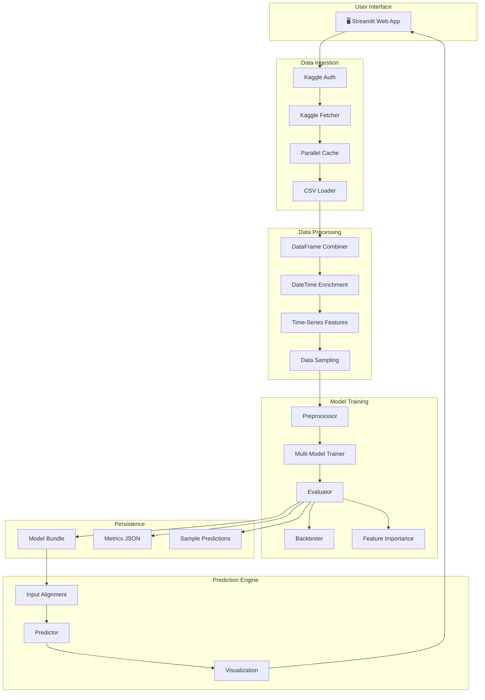
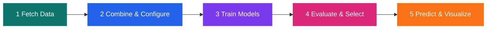
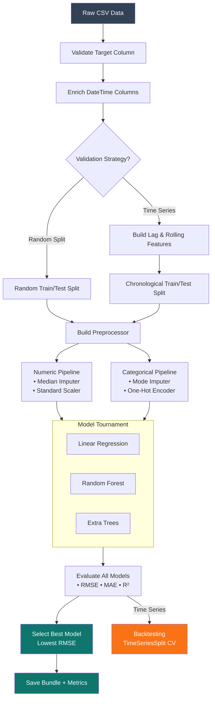
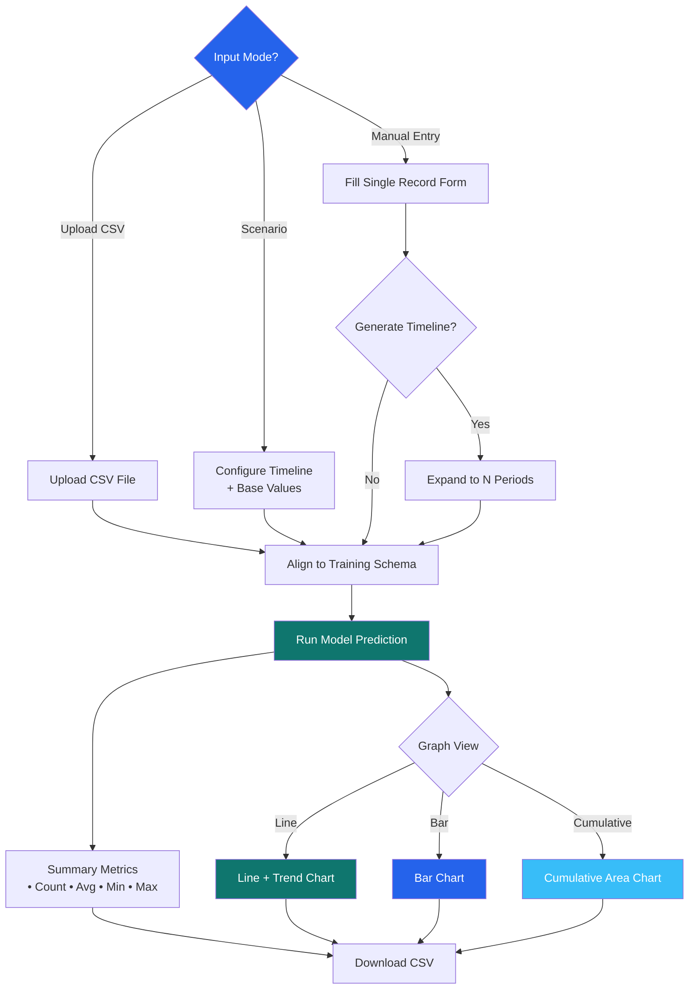
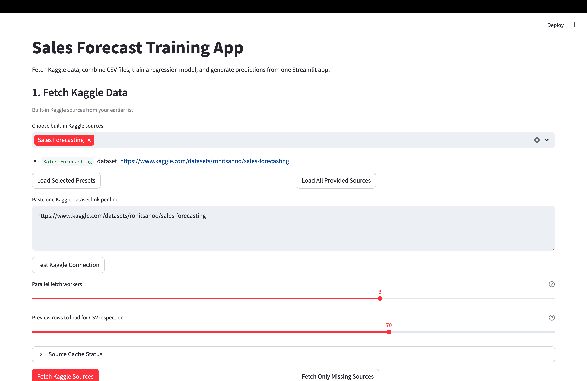
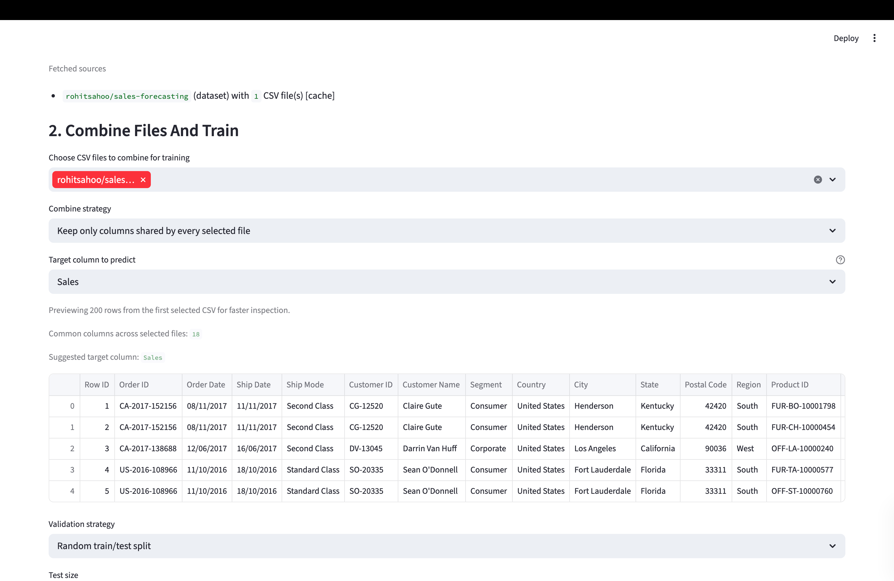
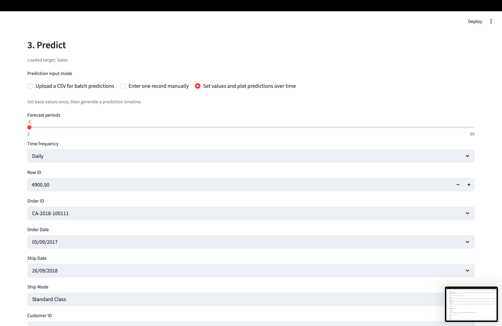
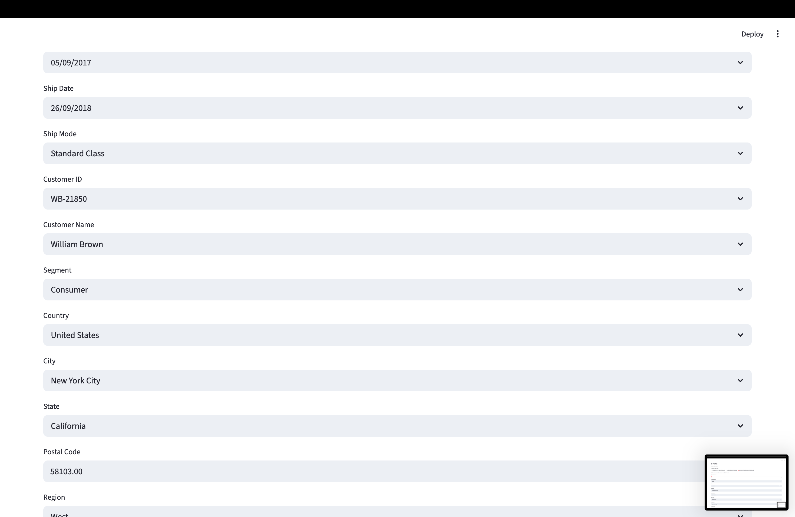

#  Sales Forecast Training App

A production-ready, end-to-end **sales forecasting platform** built with Streamlit. Fetch datasets directly from Kaggle, combine multiple CSV sources, train regression models with configurable strategies, and generate interactive predictions — all from a single web interface.

### [Live Demo](https://sales-forecasting-prediction-model-n.streamlit.app/)

---

##  System Architecture



---

## Pipeline Flow



---

## Model Training Pipeline



---

## Prediction Flow



---

## Screenshots

### 1. Fetch Kaggle Data
Connect to Kaggle, select built-in datasets or paste custom URLs, and fetch data with parallel workers.



### 2. Data Preview & Training Setup
Preview your data, select target columns, and configure the training pipeline with smart auto-detection.


### 3. Training Configuration
Fine-tune validation strategy, test size, training speed profiles, and model hyperparameters.



### 4. Prediction Interface
Choose from three prediction modes: batch CSV upload, manual single-record entry, or scenario-based forecasting.



### 5. Scenario Forecasting
Set base values and generate predictions over configurable time horizons with multiple frequencies.



---

##  Key Features

| Feature | Description |
|---|---|
| **Kaggle Integration** | Fetch datasets directly via Kaggle API with parallel downloads and smart caching |
| **Multi-Source Combine** | Merge multiple CSV files using common-column or keep-all strategies |
| **Auto Feature Engineering** | DateTime enrichment, lag features, and rolling-window statistics |
| **Model Tournament** | Trains Linear Regression, Random Forest, and Extra Trees — picks the best |
| **Time-Series Validation** | Chronological splits with TimeSeriesSplit backtesting |
| **3 Prediction Modes** | Batch CSV, manual entry, and scenario-over-time forecasting |
| **Interactive Graphs** | Switch between Line+Trend, Bar, and Cumulative views |
| **One-Click Export** | Download metrics JSON and prediction CSVs |

---

## Quick Start

### Prerequisites

- Python 3.10+
- Kaggle API credentials ([get your token here](https://www.kaggle.com/settings))

### Local Setup

```bash
# Clone the repository
git clone <your-repo-url>
cd sales-forecast-app

# Create and activate virtual environment
python3 -m venv .venv
source .venv/bin/activate  # macOS/Linux
# .venv\Scripts\activate   # Windows

# Install dependencies
pip install -r requirements.txt

# Configure Kaggle credentials
cp .env.example .env
# Edit .env with your KAGGLE_USERNAME and KAGGLE_KEY

# Run the app
streamlit run streamlit_app.py
```

The app will open at **http://localhost:8501**.

---

##  Deploy to Streamlit Cloud

### Step 1: Push to GitHub

```bash
git init
git add .
git commit -m "Initial commit: Sales Forecast Training App"
git branch -M main
git remote add origin https://github.com/<your-username>/<your-repo>.git
git push -u origin main
```

### Step 2: Deploy on Streamlit Cloud

1. Go to [share.streamlit.io](https://share.streamlit.io)
2. Click **"New app"**
3. Select your GitHub repo, branch `main`, and file `streamlit_app.py`
4. Under **Advanced settings → Secrets**, add:
   ```toml
   KAGGLE_USERNAME = "your_kaggle_username"
   KAGGLE_KEY = "your_kaggle_api_key"
   ```
5. Click **Deploy**

### Deployment Files Reference

| File | Purpose |
|---|---|
| `streamlit_app.py` | Main application entry point |
| `.streamlit/config.toml` | App theme, server settings, and production flags |
| `.streamlit/secrets.toml.example` | Template for Kaggle API secrets |
| `requirements.txt` | Python dependencies |
| `packages.txt` | System-level packages for Streamlit Cloud |
| `.env.example` | Local environment variable template |

---

##  Project Structure

```
sales-forecast-app/
├── .streamlit/
│   ├── config.toml              # Streamlit theme & server config
│   └── secrets.toml.example     # Secrets template for deployment
├── artifacts/
│   ├── streamlit_metrics.json   # Training metrics output
│   └── streamlit_sample_predictions.csv
├── data/
│   └── kaggle_cache/            # Cached Kaggle downloads
├── models/
│   └── streamlit_model_bundle.joblib  # Saved model bundle
├── screenshots/                 # App screenshots for docs
├── .env.example                 # Environment variable template
├── .gitignore
├── packages.txt                 # System deps for Streamlit Cloud
├── requirements.txt             # Python dependencies
├── streamlit_app.py             # Main application
└── README.md
```

---

##  Configuration

### Training Profiles

| Profile | RF Trees | ET Trees | Models Used |
|---|---|---|---|
| **Fast** | — | 90 | Linear Regression, Extra Trees |
| **Balanced** | 140 | 180 | Linear Regression, Random Forest, Extra Trees |
| **Accurate** | 320 | 420 | Linear Regression, Random Forest, Extra Trees |

### Time-Series Settings

| Setting | Options | Default |
|---|---|---|
| Lag Steps | 1, 2, 3, 7, 14, 28 | 1, 7, 14 |
| Rolling Windows | 3, 7, 14, 28 | 7, 14 |
| Backtest Splits | 2–6 | 3 |

---

##  Security Notes

- **Never commit `.env` or `.streamlit/secrets.toml`** — they contain API keys
- The `.gitignore` should exclude sensitive files and cached data
- XSRF protection is enabled in the Streamlit config
- File uploads are limited to 200 MB

---

##  License

This project is open source. Feel free to use and modify.
